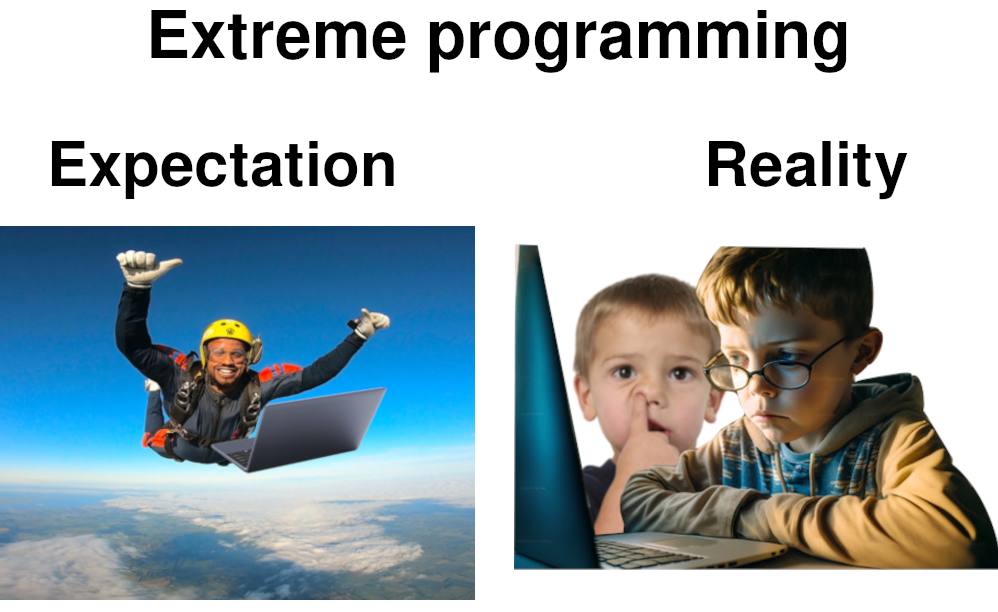

Overall, I think Extreme Programming (XP) is an “ecosystem” of practices that place a high focus on maintaining a high-quality, bug-free codebase. In my report, I will examine several core practices that I found interesting and examine the logic behind them. Then, I will use my own experiences to hypothesize some situations where XP might fail to work.

In its practices, XP’s emphasis on testing is the first thing that stood out to me. Test-driven development is something most of us programmers are familiar with. However, when it comes to XP, the importance of testing is taken to a new level. In Ron’s essay “What is Extreme Programming”, he repeatedly uses the word “obsess” when describing testing, for example:

“with a simple design and obsessively tested code”
“kept reliable by XP’s obsession with testing”
“Extreme Programming is obsessed with feedback, and in software development, good feedback requires good testing”

This obsession is justified in the sense that, testing is indeed the foundation of many other XP practices. For example, it is only with the obsession of 100% test coverage, that frequent refactoring of the code, another XP practice, is allowed. Normally, refactoring of old code is avoided as much as possible, because it can easily break existing features and often in unforeseeable ways. Hence, the famous adage in programming – “If it works don’t touch it”. XP solves this issue by obsession with test coverage. If you have automatic testing covering all use cases, then as long as one passes all the tests, one can change the code in whatever way one wants. This ability to safely refactor code in turn allowed for the principle of Simple Design.

At least for me, Simple Design strikes me as the most counter-intuitive practice. The idea of simple design in XP boils down to five words – YagNi: “You Aren’t Gonna Need It”. It tells us to code only for requirements that we have without worrying about future use cases. This goes against everything I have been trained to believe as a programmer. When making design decisions, my default mode has always been thinking through possible future use cases and finding the optimal solution that allows the most flexibility. Then, when future use cases come, I don’t need to change much. This traditional practice makes sense in most cases. However, when it comes to XP, it is rather an overkill – because changes aren’t expensive in XP! With comprehensive test coverage, you can refactor easily without risk. So instead of preparing for a future that might never come, XP practice chooses to minimize work and deal with future use cases as they come.

Last but not least, pair programming is also a practice that surprises to me. Every line production code in XP must be written by a pair, so every line code has been fully reviewed by at least one person. I think this emphasis really illustrates the great importance XP places on the quality of code. What surprised me even more was how many positive stories others shared on the XP wiki article on Pair Programming. According to them, pair programming avoids “any problems resulting from mediocre programmers writing poor code and documentation” and reduces the “time of indecision”.

In theory, XP sounds like a great way to produce software. A team can produce quality code and develop at a high speed because: firstly code quality is good, and secondly it is easy to refactor so programmers can stick to simple design. However, I think in practical applications, XP can be very hard to implement.

Firstly, for the practice of pair programming, the team has to be very collaborative and have at least some level of skills. I have never pair-programmed on a project, but there have been times when I programmed together with friends when I tried explaining some concepts, so I know it could be a frustrating experience if the two people are not communicating on the same level; in other words, when the other person “just don’t get it”. It could be even worse if the two people don’t have rapport between them. Even when both people are communicating well, I think it can still be exhausting to do just considering how much energy must go into thinking, coding, and communicating.

Similarly, the practice of Test Driven Development and Collective Ownership can break down easily because they require the team members to take initiative. The core of XP lies in the obsession with testing, which requires the developer to go out of their way to ensure all necessary test cases are added, run, and passed when developing. However, in practice, it is possible to have people taking the easy way out and not writing enough test cases for expediency. Similarly, Collective Ownership requires the team to do the right but the hard thing. They need to take initiative and work with unfamiliar code of others to add relevant features.

Lastly, I have doubts about the speed of development in XP, especially when the project scale is small. In the early stage of a project or in a small project, I don’t think the code base will be large enough to even worry about code quality dragging down the speed. In some scenarios, like in the case of a startup or prototype, it is even uncertain whether the project will grow to a stage where code quality will matter. In this case, many XP practices like pair programming and obsessive automated testing, can seem like overkill.

All in all, I think Extreme Programming is like what its name suggests – extreme. With its emphasis on code quality, it can bring great benefits in the long run if the team is working on a large-scale project with a team of quality programmers, but this emphasis can be a double-edge sword. When the team or project lacks necessary quality for XP, forcing it on the team can only backfire.
