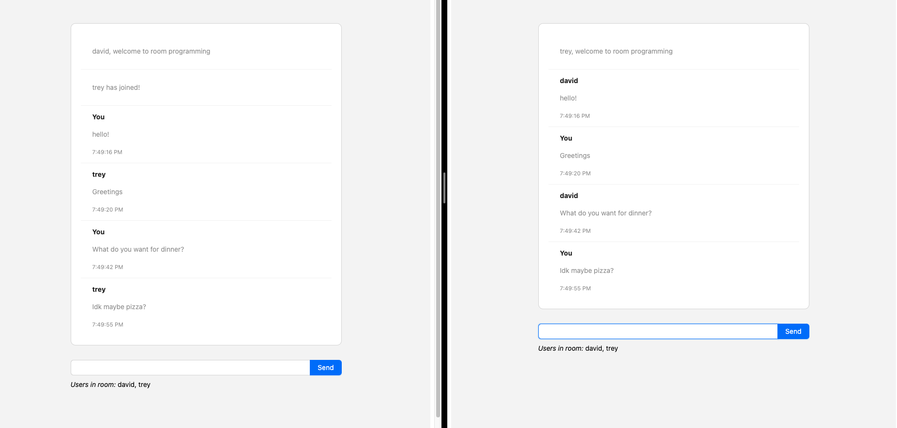

A minimalistic live chat app with user and chat room, built using node.js and socket.io with react.js front-end. It also shows activity likes "user is typing" to other participants in the chatroom.

You can try it out live by clicking  <a href="https://my-chat-app-five-lemon.vercel.app/"> here </a>! Make a room in one tab; join the room from another tab (or have your friend join!), and let conversations happen.

The deployment was done using Vercel for the front-end. Azure Web Service for the back end because vercel doesn't seem to support web socket, at least not easily : \(

## What I learned

This experience taught me a lot about how to use web socket for real time communications. Deploying it on the web also gave me the experience with Vercel.

The deployment was done using Vercel for the front-end

## Show me the code

Here is a snippet of my code and link to github repo:


Source: <a href="https://github.com/DavidHuang2002/my-chat-app">my-chat-app</a>
