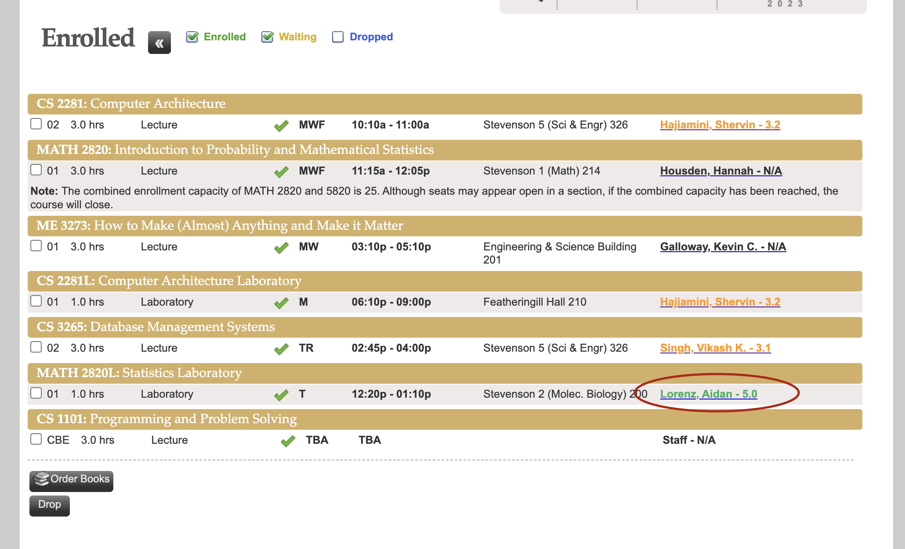

The colors and the scores next to professors' names are added by the extension:

## the story

Course registration is a pain. One of my biggest pain points is constantly switching back and forth between YES (our course registration website) and Rate My Professors. So I thought to myself, wouldn't it be great if I can simply see professors' Rate My Prof. scores directly on YES... Maybe there are already tools for that?

Sadly, no. After some searching I found the closest thing is an existing extension VandyScheduler. It used to have similar functionality but the creator graduated, and it has been broken for a long time. However, I think I can fix it.

So I updated its background scraping mechanism to get rate my professor scores, contacted the original developer, and eventually got it fixed. Later, I added the functionality of making professors' names into links that allow students to directly go to their rate my professor page.

## the impact

This is my favorite project. Although it is not difficult technically, it has a tangible impact of helping myself and people around me. After the update, I told everyone around me about this extension, and they all loved it. Now, once in a while I catch glimpses of completely strangers using this extension, and I think I have made something really useful.

## show me the code



Here is the link to its <a href="https://github.com/quinton22/VandyScheduler"> git repo </a> and <a href="https://chromewebstore.google.com/detail/vandy-scheduler/ofkamcklfkpakjddlappmemldnnapina"> chrome web store </a>. You can see my contribution from the last few commits!
